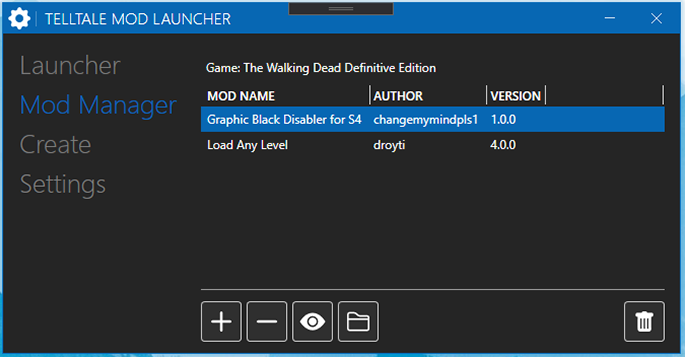
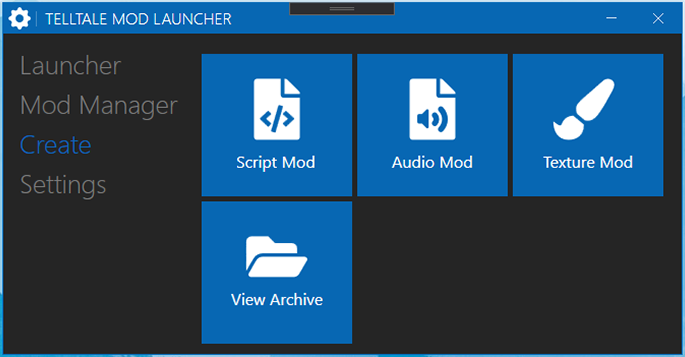

# Telltale Mod Launcher

  

**Releases are now being put out! You can get them [HERE](https://github.com/Telltale-Modding-Group/TelltaleModLauncher/releases)!**
**If you need help or have questions about the application, click [HERE](https://github.com/Telltale-Modding-Group/TelltaleModLauncher/wiki/%5BHelp%5D-Application-Setup)!**
**If your looking for Mods to get, supported mods can be found [HERE](https://github.com/Telltale-Modding-Group/TelltaleModLauncher/wiki/Supported-Mods)!** **[Discord Server](https://discord.gg/rn8HvqZjZZ)**

## DISCLAIMER
***NOTE: This project is a work in progress. Some features have not been implemented just yet and there could be issues/bugs that you might encounter. If you do please follow [this](https://github.com/Telltale-Modding-Group/TelltaleModLauncher/wiki/%5BHelp%5D---Reporting-an-Issue-or-Bug) to submit an issue.***

***NOTE (3/16/21): Creator functionality is being stripped and moved to the [Telltale Script Editor](https://github.com/Telltale-Modding-Group/Telltale-Script-Editor) as of the next release V0.7.0 which will be coming soon [(biggest update yet)](https://github.com/Telltale-Modding-Group/TelltaleModLauncher/blob/main/changes.txt).***

## Supported Games
The launcher currently supports the following games.
- **The Walking Dead Definitive Edition**

NOTE: The installer has not been tested with any other Telltale game besides 'The Walking Dead Definitive Edition' though future support is planned.

## About
This launcher is designed to make installing and managing mods for Telltale Games much easier through a very user friendly interface.

If you wish to make mods, we have the following tools avaliable.
- **[Texture Mods](https://github.com/Telltale-Modding-Group/DDS-D3DTX-Converter)**
- **[Scripting Mods](https://github.com/Telltale-Modding-Group/Telltale-Script-Editor)**

